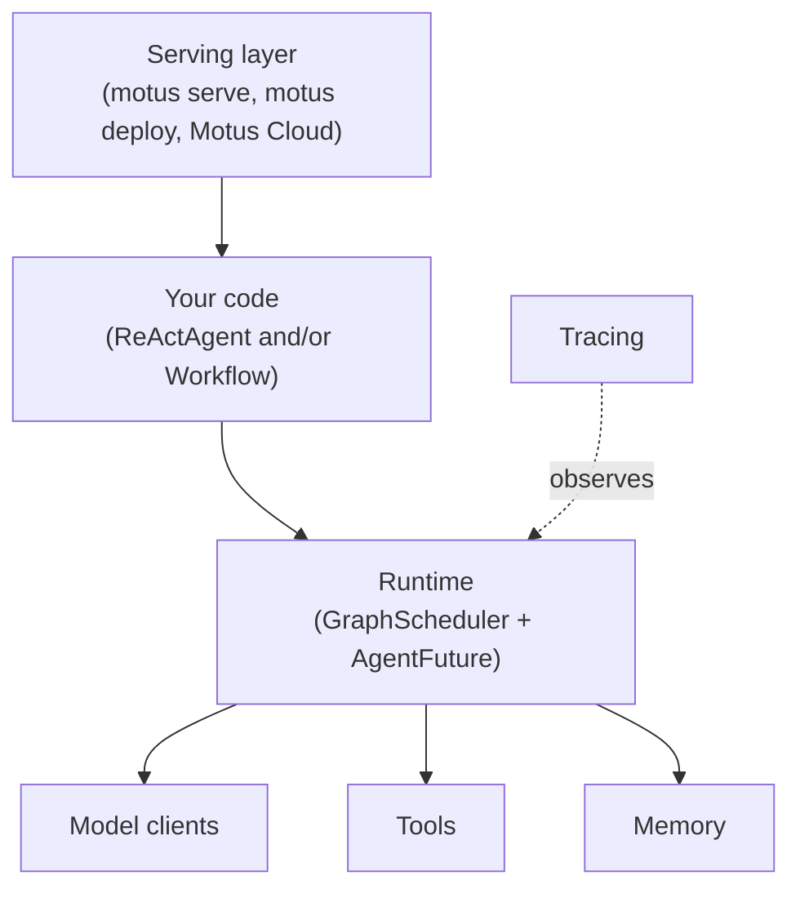

Motus is an open source agent serving project. It also ships a Python library for writing the agents you serve. This page is a map of that library: the two programming models it supports, the runtime underneath them, and where to go for each concept.

## Two programming models on one runtime

Motus gives you two ways to write an agent, and both run on the same underlying runtime. You pick the one that matches your problem, and the two can be combined when you need to.

<CardGroup cols={2}>
  <Card title="ReActAgent: the reasoning loop" icon="robot" href="/concepts/agents">
    For exploratory, open-ended problems. The model decides what to do next. You hand `ReActAgent` a client, a set of tools, and a system prompt. It calls the model, runs any tool calls the model asks for, feeds the results back, and loops until the model returns a final answer.
  </Card>
  <Card title="Workflow: the task graph" icon="diagram-project" href="/concepts/runtime">
    For stable control over a known-good procedure. You decide what to do next. Decorate plain Python functions with `@agent_task`, call them, and Motus turns the data flow between them into a parallel task graph. No DAG wiring, no YAML.
  </Card>
</CardGroup>

Roughly, the two shapes look like this:

```python ReActAgent
from motus.agent import ReActAgent
from motus.models import OpenAIChatClient

agent = ReActAgent(
    client=OpenAIChatClient(),
    model_name="gpt-4o",
    tools=[weather, search],
)
answer = await agent("What's the weather in Tokyo?")
```

```python Workflow
from motus.runtime import agent_task, resolve

@agent_task
def fetch(url): ...

@agent_task
def summarize(pages): ...

pages = [fetch(url) for url in urls]   # parallel fetches
result = resolve(summarize(pages))     # runs once every fetch is done
```

### When to reach for which

Reach for `ReActAgent` when the problem is open-ended and you want the agent to discover the right steps on its own. Research, debugging, triage, coding agents, customer support, anything where you cannot write down the plan in advance. You give it tools and let the model explore.

Reach for `Workflow` when the procedure is already a solved problem and you want stable, repeatable control over it. ETL pipelines, evaluation harnesses, content processing, batch LLM jobs, anything where the steps are well understood and you mostly want parallelism, retries, and observability around them.

The two compose. A workflow step can call a `ReActAgent` when part of an otherwise stable pipeline needs exploration. An agent can delegate to another agent via `as_tool()` when one exploratory loop should hand off to a more specialized one.

## The layers



From the top down:

1. **Serving** wraps any agent behind a session-based HTTP API. `motus serve` runs it locally, `motus deploy` ships the same code to Motus Cloud, and the REST surface is identical on both. A session is one persistent conversation between a user and an agent.
2. **Your code** sits under the serving layer. It is a `ReActAgent`, a Workflow built out of `@agent_task` functions, or both.
3. **The runtime** is where everything actually executes. Every model call, every tool call, and every workflow step becomes a node in a task graph. A scheduler (`GraphScheduler`) runs the graph, and each node returns an `AgentFuture` that tracks its result and any downstream dependencies.
4. **Model calls and tool calls** go through the runtime as tasks, which is how retries, timeouts, and tracing apply to them uniformly. **Memory** is not a task: it is session state the agent reads and writes directly around each turn.
5. **Tracing** watches the runtime through lifecycle hooks. It records spans for every task without you instrumenting anything by hand.

## Module map

Jump straight to the page you need.

| Concept | Reach for it when... | Page |
|---|---|---|
| **Agents** | You want an LLM to drive a loop over tools | [Agents](/concepts/agents) |
| **Tools** | You want to give an agent a new capability | [Tools](/concepts/tools) |
| **Models** | You want to swap providers or configure reasoning and caching | [Models](/concepts/models) |
| **Memory** | You want multi-turn context that handles long conversations | [Memory](/concepts/memory) |
| **Runtime** | You want a parallel workflow or a custom task graph | [Runtime](/concepts/runtime) |
| **Guardrails** | You want to validate inputs or outputs before or after a turn | [Guardrails](/guides/guardrails) |
| **Human in the loop** | You want to pause mid-turn for approval or clarification | [Human in the Loop](/guides/human-in-the-loop) |
| **Multi-agent** | You want one agent to call another as a tool | [Multi-agent](/guides/multi-agent) |
| **MCP** | You want to pull tools from an MCP server | [MCP Integration](/guides/mcp-integration) |
| **Skills** | You want the agent to load extra instructions and examples on demand | [Skills](/concepts/skills) |

For the serving and deployment side, see [Serving](/guides/serving), [Deployment](/guides/deployment), and [Tracing](/guides/tracing).

## Where to go next

Pick a starting point based on what you want to build.

- **A single LLM-driven assistant.** Start with [Agents](/concepts/agents), then [Tools](/concepts/tools), then [Memory](/concepts/memory).
- **A parallel pipeline or batch job.** Start with [Runtime](/concepts/runtime). Circle back to [Agents](/concepts/agents) if any step needs an LLM.
- **A team of agents.** See [Multi-agent](/guides/multi-agent) for how `as_tool()` turns one agent into a tool for another.
- **An agent that needs external tools.** See [MCP Integration](/guides/mcp-integration) to plug in any MCP server.
- **An existing agent from another framework.** See the [Integrations](/integrations/openai-agents) tab for OpenAI Agents SDK, Anthropic SDK, and Google ADK adapters.
- **Shipping any of the above.** See [Serving](/guides/serving) for the REST API and [Deployment](/guides/deployment) for the cloud workflow.
