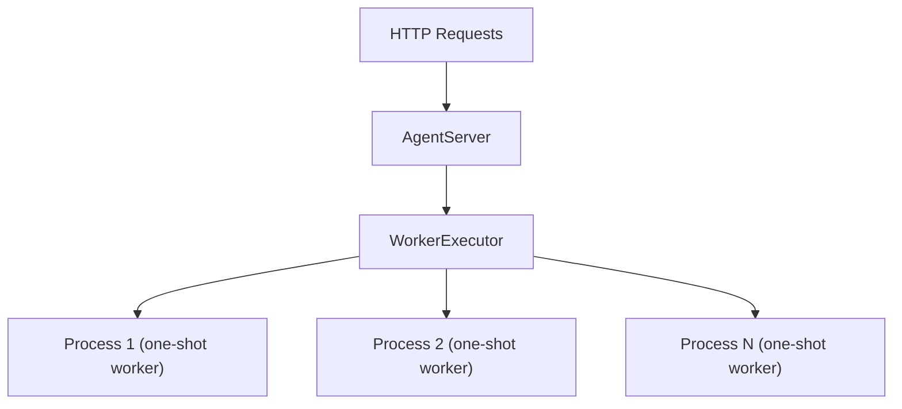

The self-managed motus exposes any agent as an HTTP server with session-based conversations using `motus serve`. Each message spawns a fresh worker subprocess, so your agent runs in complete isolation. No shared state between requests, and a crash in one turn never affects another.

## Quick start

Define your agent in a Python file, then start the server:

```python myapp.py
from motus.agent import ReActAgent
from motus.models import AnthropicChatClient

client = AnthropicChatClient()

agent = ReActAgent(
    client=client,
    model_name="claude-opus-4-6",
    system_prompt="You are a helpful assistant.",
)
```

```bash
# Start the server
motus serve start myapp:agent --port 8000

# Chat interactively in a new terminal
motus serve chat http://localhost:8000
```

## Agent types

Every agent type follows the same turn contract: receive a `ChatMessage` and the session's prior state, return a response `ChatMessage` and updated state. All agent types run in worker subprocesses and must be importable from the module level.

| Parameter | Type | Description |
| --- | --- | --- |
| `message` | `ChatMessage` | The new user message (constructed by the server from the HTTP request). |
| `state` | `list[ChatMessage]` | The session's state from the previous turn (empty list on first turn). |

**Return value**: `tuple[ChatMessage, list[ChatMessage]]` the response message (surfaced to the HTTP client) and the updated state (stored in the session). The agent owns the state and can append, compact, or restructure it freely.

<Tabs>
  <Tab title="ServableAgent">
    Any object with a conforming `run_turn` method can be served directly. This is a runtime checkable. `Protocol`inheritance is not required.

    ```python
    from motus.serve import ServableAgent
    from motus.models.base import ChatMessage

    class MyAgent(ServableAgent):
        async def run_turn(
            self,
            message: ChatMessage,
            state: list[ChatMessage],
        ) -> tuple[ChatMessage, list[ChatMessage]]:
            response = ChatMessage.assistant_message(content="hello")
            return response, state + [message, response]
    ```

    Built-in implementations include `AgentBase` and all of its subclasses (such as `ReActAgent`).
  </Tab>
  <Tab title="Google ADK">
    Google ADK agents are supported via `motus.google_adk.agents.Agent`, a subclass of the ADK `Agent` that implements `ServableAgent`. Session history is replayed automatically each turn.

    ```python
    from motus.google_adk.agents.llm_agent import Agent

    agent = Agent(
        model="gemini-2.0-flash",
        name="my_agent",
        instruction="You are a helpful assistant.",
    )
    ```

    ```bash
    motus serve start myapp:agent
    ```

    Requires the optional `google-adk` dependency.
  </Tab>
  <Tab title="Anthropic SDK">
    Anthropic SDK tool runners are supported via `motus.anthropic.ToolRunner`. Define tools with the `@beta_async_tool` decorator and pass the runner directly. A fresh runner is created per turn.

    ```python
    from motus.anthropic import ToolRunner, beta_async_tool

    @beta_async_tool
    async def get_weather(city: str) -> str:
        """Get the weather for a city."""
        return f"Sunny in {city}"

    runner = ToolRunner(
        model="claude-sonnet-4-20250514",
        max_tokens=1024,
        tools=[get_weather],
        system="You are a helpful assistant.",
    )
    ```

    ```bash
    motus serve start myapp:runner
    ```

    Requires `anthropic>=0.49.0`. Pass `max_iterations` to limit the tool-use loop.
  </Tab>
  <Tab title="OpenAI Agents SDK">
    OpenAI Agents SDK agents are supported via auto-detection — no adapter import needed. Guardrail tripwire exceptions are caught and returned as refusal messages. Structured output is serialized to JSON.

    ```python
    from agents import Agent

    agent = Agent(
        name="my_agent",
        instructions="You are a helpful assistant.",
    )
    ```

    ```bash
    motus serve start myapp:agent
    ```

    Requires the optional `openai-agents` dependency.
  </Tab>
  <Tab title="Callable function">
    Plain functions with the signature `(message, state) -> (response, state)` are supported. Both sync and async functions work:

    ```python
    from motus.models.base import ChatMessage

    # Sync
    def my_agent(message, state):
        response = ChatMessage.assistant_message(content="hello")
        return response, state + [message, response]

    # Async
    async def my_agent(message, state):
        result = await some_api_call(message.content)
        response = ChatMessage.assistant_message(content=result)
        return response, state + [message, response]
    ```
  </Tab>
</Tabs>

## Session lifecycle

Each conversation is a session. A session moves through the following states:

| Status | Description |
| --- | --- |
| `idle` | Waiting for input. Initial state after creation. |
| `running` | Processing a message. Concurrent sends are rejected with `409`. |
| `error` | Agent raised an exception. The `error` field contains the message. |

```text
idle ──POST /messages──▶ running ──success──▶ idle
                               └──failure──▶ error
error ──POST /messages──▶ running
```

<Note>
  A session in `error` state can receive new messages and transitions back to `running`. Sessions are held in memory and do not persist across server restarts.
</Note>

When `--ttl` is set, idle and errored sessions whose last activity exceeds the TTL are swept by a background task. When `--timeout` is set, agent turns that exceed the limit are killed and the session transitions to `error` with an `"Agent timed out"` message.

## Architecture



Each message spawns a fresh subprocess via `multiprocessing.Process` with pipe-based IPC. An `asyncio.Semaphore` limits concurrency to `max_workers`. Processes are not reused: each one starts, runs the agent function, sends the result over the pipe, and exits. On timeout or cancellation, the process is killed immediately.

This subprocess isolation model means:

- A crash in one agent turn never affects other sessions or the server itself.
- No shared state leaks between requests.
- Resource cleanup is automatic — when the process exits, all memory is reclaimed.

<Accordion title="File structure">
  ```text
  serve/
  ├── __init__.py       # Public exports: AgentServer, ServableAgent
  ├── protocol.py       # ServableAgent runtime-checkable protocol
  ├── server.py         # AgentServer class (FastAPI routes, background tasks)
  ├── worker.py         # WorkerExecutor, subprocess execution, agent type dispatch
  ├── schemas.py        # Pydantic models (SessionStatus, request/response types)
  ├── session.py        # Session dataclass and in-memory SessionStore
  └── cli.py            # CLI (start, chat, health, create, sessions, get, delete, messages, send)
  ```
</Accordion>

<Tip>
  For detailed CLI usage and all available flags, see the [CLI reference for `motus serve`](/reference/cli/serve/overview).
</Tip>

## Server options

Start options for `motus serve start`:

| Flag | Default | Description |
| --- | --- | --- |
| `--host` | `0.0.0.0` | Bind address |
| `--port` | `8000` | Port |
| `--workers` | CPU count | Max concurrent worker processes |
| `--ttl` | `0` | TTL for idle/error sessions in seconds (`0` = disabled) |
| `--timeout` | `0` | Max seconds per agent turn before the worker is killed (`0` = no limit) |
| `--max-sessions` | `0` | Maximum concurrent sessions (`0` = unlimited) |
| `--shutdown-timeout` | `0` | Seconds to wait for in-flight tasks on shutdown before cancelling (`0` = wait indefinitely) |
| `--allow-custom-ids` | `false` | Enable `PUT /sessions/{id}` for client-specified session IDs |
| `--log-level` | `info` | Log verbosity: `debug`, `info`, `warning`, `error` |

```bash
motus serve start myapp:agent --port 8080 --workers 8 --ttl 3600 --timeout 60
```

## CLI reference

### `motus serve chat`

Send a message or enter an interactive REPL:

```bash
# Interactive REPL (creates and cleans up a session automatically)
motus serve chat http://localhost:8000

# Single message
motus serve chat http://localhost:8000 "hello"

# Keep the session after exit for later resumption
motus serve chat http://localhost:8000 --keep

# Resume an existing session
motus serve chat http://localhost:8000 --session 550e8400-e29b-41d4-a716-446655440000
```

| Flag | Default | Description |
| --- | --- | --- |
| `--session` | — | Resume an existing session instead of creating a new one |
| `--keep` | `false` | Preserve the session on exit (prints session ID) |
| `--param` | — | `KEY=VALUE` per-request parameter passed as `user_params` (repeatable) |

### Other commands

| Command | Description |
| --- | --- |
| `motus serve health <url>` | Check server status and worker counts |
| `motus serve create <url>` | Create a new session |
| `motus serve sessions <url>` | List all active sessions |
| `motus serve get <url> <id> [--wait]` | Get session details; `--wait` blocks until not running |
| `motus serve delete <url> <id>` | Delete a session |
| `motus serve messages <url> <id>` | Get the full conversation history |
| `motus serve send <url> <id> <msg> [--wait]` | Send a message; `--wait` blocks for completion |

## Python API

Use `AgentServer` to embed the server in your own Python application:

```python
from motus.serve import AgentServer

server = AgentServer(my_agent, ttl=3600, timeout=30)
server.run(host="0.0.0.0", port=8000)
```

**Constructor parameters** (all except `agent_fn` are keyword-only):

| Parameter | Type | Default | Description |  |
| --- | --- | --- | --- | --- |
| `agent_fn` | \`Callable | str\` | required | A `ServableAgent`, OpenAI Agent, callable, or import path string (e.g., `"myapp:my_agent"`) |
| `max_workers` | \`int | None\` | `None` | Max concurrent worker processes. Defaults to `os.cpu_count()`, fallback `4`. |
| `ttl` | `float` | `0` | TTL for idle/error sessions in seconds. `0` disables expiry. |  |
| `timeout` | `float` | `0` | Max seconds per turn before the worker is killed. `0` disables. |  |
| `max_sessions` | `int` | `0` | Maximum concurrent sessions. `0` means unlimited. |  |
| `shutdown_timeout` | `float` | `0` | Seconds to wait for in-flight tasks on shutdown. `0` waits indefinitely. |  |
| `allow_custom_ids` | `bool` | `False` | Enable `PUT /sessions/{id}` for client-specified IDs. |  |

**`run(host, port, log_level) -> None`** — starts the server (blocking).

| Parameter | Type | Default | Description |
| --- | --- | --- | --- |
| `host` | `str` | `"0.0.0.0"` | Bind address |
| `port` | `int` | `8000` | Port |
| `log_level` | `str` | `"info"` | Uvicorn log level |

The `server.app` property exposes the underlying `FastAPI` application for testing or mounting in a larger application.
